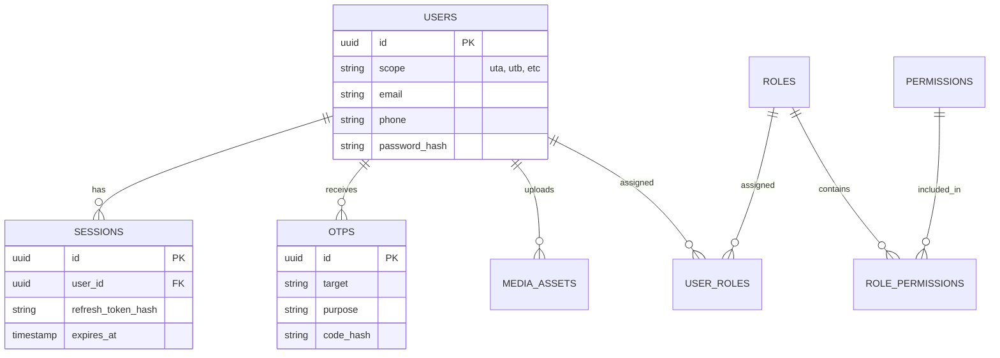

# Unitoko Backend Documentation

**Version:** 2.0 (Feb 2026)
**Stack:** Node.js, Express, PostgreSQL (Knex.js)

This document serves as the comprehensive source of truth for the Unitoko Backend architecture, database schema, and implemented systems.

---

## 1. System Overview

Unitoko Backend is a **multi-tenant, multi-application** backend service. It does not serve a single frontend; instead, it serves four distinct "Scopes" (Applications), ensuring logic separation while sharing a core database.

### The 4 Scopes
| Scope Code | Application Name | Target Audience | Key Features |
| :--- | :--- | :--- | :--- |
| **UTA** | **Unitoko Admin** | Internal Staff, Super Admins | User management, verification, system config. |
| **UTB** | **Unitoko Business** | Sellers, Branch Managers | Store management, inventory, earning reports. |
| **UTC** | **Unitoko Customer** | End Users | Browsing, ordering, payments. |
| **UTD** | **Unitoko Delivery** | Riders | Delivery tasks, earnings, navigation. |

### Architecture Layers
The backend follows a strict **Controller-Service-Repository** pattern to ensure separation of concerns.

```mermaid
graph TD
    Client[Client App (UTA/UTB...)] -->|HTTP Request| Route[Express Route]
    Route -->|Middleware| Auth[Auth & RBAC Guards]
    Auth --> Controller[Controller]
    Controller -->|Business Logic| Service[Service Layer]
    Service -->|Data Access| Repo[Repository Layer]
    Repo -->|SQL Query| DB[(PostgreSQL)]
```

---

## 2. Project Structure

```text
/
├── migrations/             # SQL Migration files (Knex)
├── src/
│   ├── config/             # Config loaders (DB, env vars)
│   ├── controllers/        # Request handlers (req, res logic)
│   ├── middleware/         # Express middleware (Auth, RBAC, Uploads)
│   ├── repositories/       # database interactions (Knex queries)
│   ├── routes/             # Route definitions
│   │   ├── admin/          # Routes specific to UTA
│   │   └── auth.routes.js  # Central authentication routes
│   ├── services/           # Reusable business logic
│   ├── utils/              # Helpers (Crypto, Date, etc.)
│   ├── validators/         # Joi Schemas for request validation
│   └── server.js           # App Entry point
├── uploads/                # Local storage for media files
├── .env                    # Environment variables
└── package.json            # Dependencies
```

---

## 3. Database Schema

The database uses **UUIDs** for all primary keys.

### 3.1 Entity Relationship Diagram



### 3.2 Tables Breakdown

#### **Identity & Auth**
| Table | Description | Key Columns |
| :--- | :--- | :--- |
| **`users`** | Core identity for all actors. | `id`, `scope`, `email`, `phone`, `password_hash`, `status` |
| **`sessions`** | Active refresh tokens for long-lived sessions. | `user_id`, `refresh_token_hash`, `device_id`, `revoked_at` |
| **`otps`** | One-Time Passwords for login/verification. | `target` (email/phone), `code_hash`, `purpose` (`login`, `register`) |
| **`admin_access_requests`** | Workflow for new admins requesting access. | `email`, `status` (`pending`, `approved`), `approved_by` |

#### **Access Control (RBAC)**
| Table | Description | Key Columns |
| :--- | :--- | :--- |
| **`roles`** | Named roles like `super_admin`, `customer`. | `name`, `scope` |
| **`permissions`** | Granular actions like `orders:read`. | `slug`, `scope` |
| **`user_roles`** | Mapping users to roles. | `user_id`, `role_id` |
| **`role_permissions`** | Mapping roles to permissions. | `role_id`, `permission_id` |

#### **Assets**
| Table | Description | Key Columns |
| :--- | :--- | :--- |
| **`media_assets`** | Metadata for uploaded files (local/S3). | `user_id`, `url`, `mimetype`, `size` |

---

## 4. API Endpoints

### 4.1 Authentication (`/api/auth`)
| Method | Endpoint | Purpose | Access |
| :--- | :--- | :--- | :--- |
| `POST` | `/login` | Password-based login. Returns Access/Refresh tokens. | Public |
| `POST` | `/otp/send` | Send OTP for Login or Registration. | Public |
| `POST` | `/otp/verify` | Verify OTP and exchange for tokens. | Public |
| `POST` | `/refresh` | Get new Access Token using Refresh Token. | Public |
| `POST` | `/logout` | Revoke current session. | Auth Required |
| `PUT` | `/profile` | Update own profile details. | Auth Required |
| `GET` | `/me` | Get current user info. | Auth Required |

### 4.2 Admin Workflows (`/api/auth/admin`)
| Method | Endpoint | Purpose | Access |
| :--- | :--- | :--- | :--- |
| `POST` | `/request` | New admin requests access to system. | Public |
| `POST` | `/verify` | Verify OTP for admin request. | Public |
| `POST` | `/requests/:id/approve` | Super Admin approves a request. | **Super Admin** |

### 4.3 Media (`/api/auth/media`)
| Method | Endpoint | Purpose | Access |
| :--- | :--- | :--- | :--- |
| `POST` | `/upload/avatar` | Upload profile picture. | Auth Required |

---

## 5. Key Systems

### 5.1 RBAC (Role-Based Access Control)
The system uses a strictly scoped RBAC.
*   **Scopes**: A role exists ONLY within a scope. A `super_admin` in `uta` cannot automatically control `utb` unless explicitly granted.
*   **Permissions**: Strings formatted as `resource:action` (e.g., `users:manage`, `reports:view`).
*   **Middleware**: `requirePermission('slug')` blocks access if the user's role doesn't have the permission.

### 5.2 Multi-Scope Users
A single human can have multiple identities.
*   **Example**: `john@example.com` can be a **Customer (UTC)** AND a **Seller (UTB)**.
*   **Implementation**: This is handled by the **Unique Constraint** `(email, scope)`. They will have TWO rows in the `users` table with different UUIDs.

### 5.3 Authentication Flow
1.  **Login**: User sends credentials.
2.  **Validation**: Server validates password or OTP.
3.  **Session**: A persistent `session` row is created.
4.  **Crypto**: A `refresh_token` is generated, **hashed**, and stored. The raw token is sent to the client.
5.  **JWT**: A short-lived (15m) `access_token` is signed and sent to the client.
6.  **Refresh**: Client uses `refresh_token` to get a new `access_token`. Server checks if the session is revoked or expired.

---

## 6. How to Run

### Prerequisites
*   Node.js v18+
*   PostgreSQL running locally or via Docker.

### Setup
```bash
# 1. Install dependencies
npm install

# 2. Setup Environment
cp .env.example .env
# Edit .env with your DB credentials

# 3. Run Migrations
npm run migrate

# 4. Start Dev Server
npm run dev
```

### Running Tests
Currently, manual tests are set up via HTML files in `tests/ui/` which act as a dashboard to ping the API locally.
